**RALLY:**

We got to the rally and delivered our 3rdF donations while observing a trailer of telephone poles. Wonder what those could be for? YHC was amped up at the rally and just wanted to get into the ruck. It was good to meet the cadre and trainers, in advance, and hear them speak about the event and the expectations. I think it was here at the rally that I heard something that went through my mind all night, during the ruck, “He who knows his why, can endure almost any how.” I’ll say, after hearing them speak, I was ready to run through a wall. There were some great conversations and it was cool hearing from pax from other regions. Tea Party and YHC got an idea for a cool CSAUP to bring back to Carpex from the folks in Waxhaw while also sharing the MOAB idea with them. 

**KINGBUILDER:**

This was one of the things YHC was really looking forward to for the weekend. You don’t get many chances to do an F3 workout on the deck of the USS North Carolina battleship. We were joined by Skipper and Shut-In who joined us for the bootcamp. We started on dry land with a trumpet performance of the star-spangled banner, some cadence exercises, a short jog, and some more exercises before we made our way onto the ship. The trainers leading the workout were Bono, Uno, and Power Clean. NOTE: Keeping SSHs in cadence at a slow cadence is actually pretty difficult. They got some pax that had recently joined F3 and an FNG to lead us in a few of the workouts and used other pax to help teach them how to lead an exercise. One of the coolest moments during the workout, for YHC, was when we were doing smurf jacks on the Battleship. It sounded like a war drum as we prepared for the crucible ruck. We finished up at the back of the ship for a photo, taps on the trumpet, a modified COT, and the naming of some FNGs. There were 218 people on that battleship! We got a preview of the weather to come as it was rainy, windy, and cold. PERFECT.

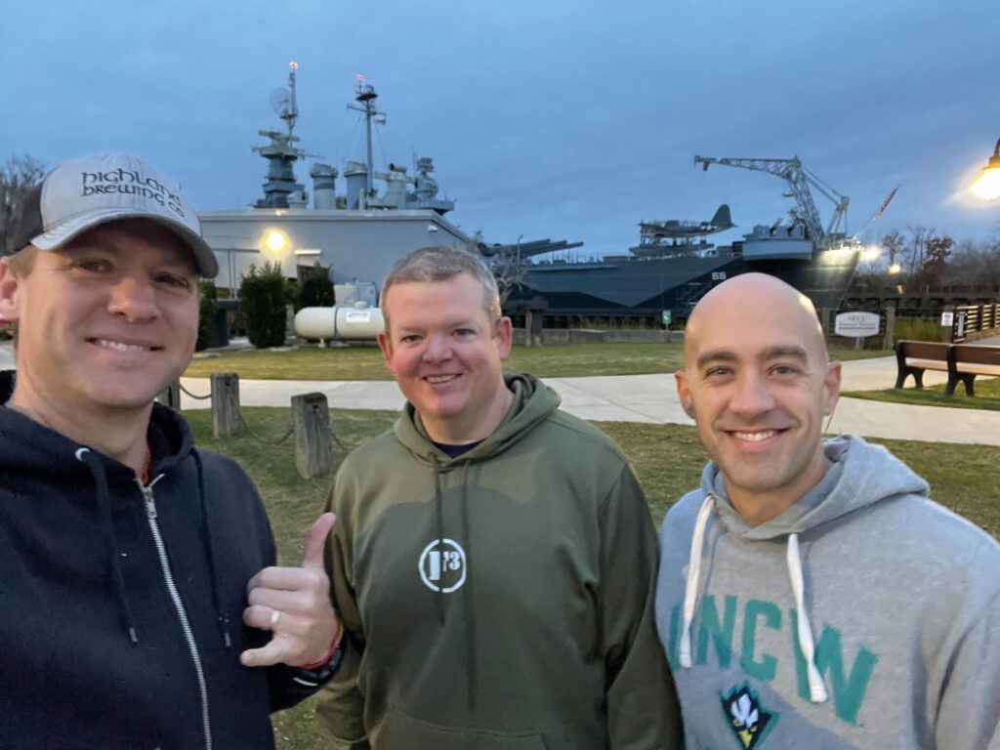

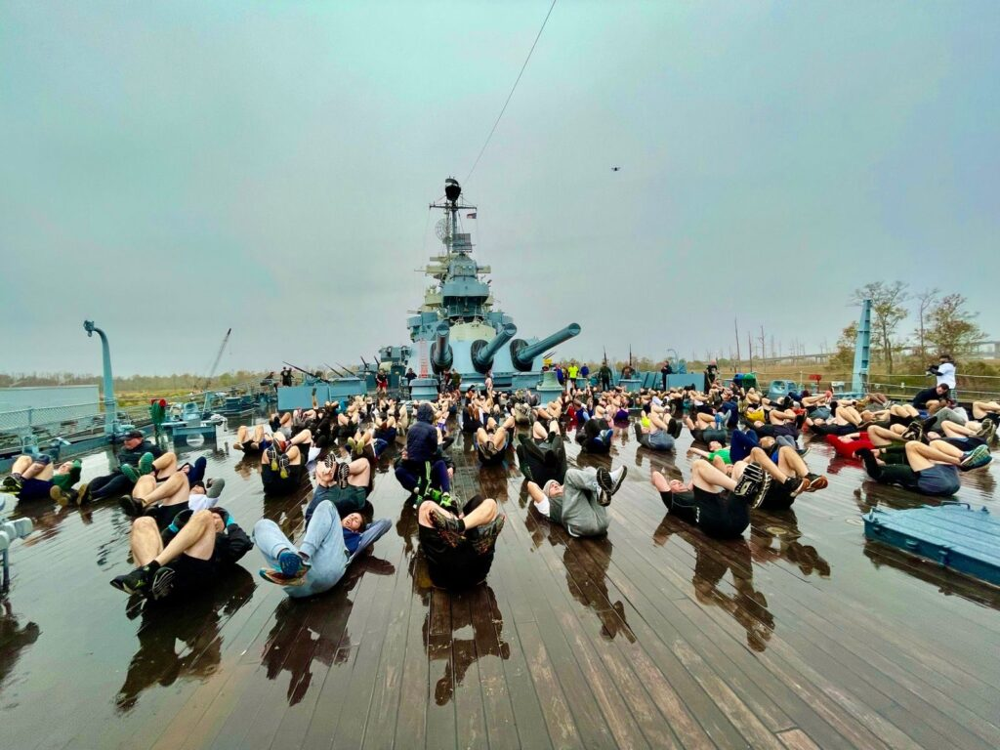

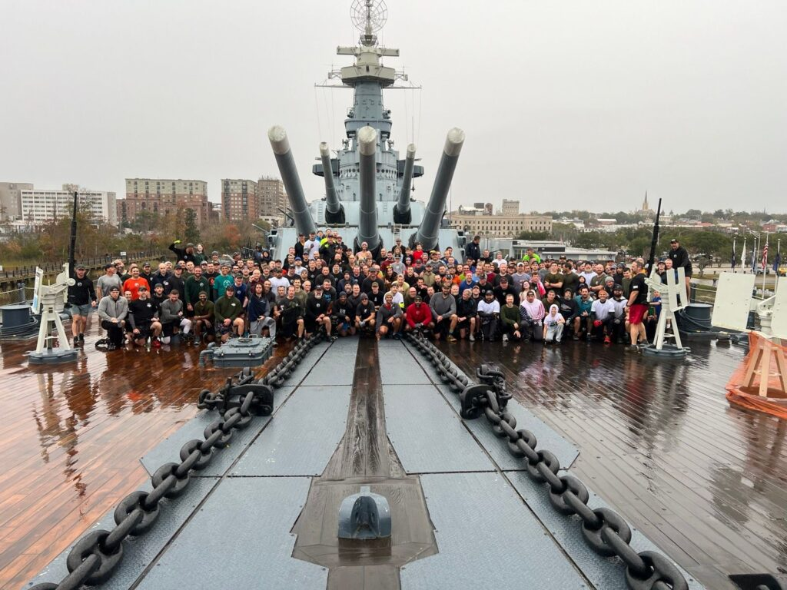

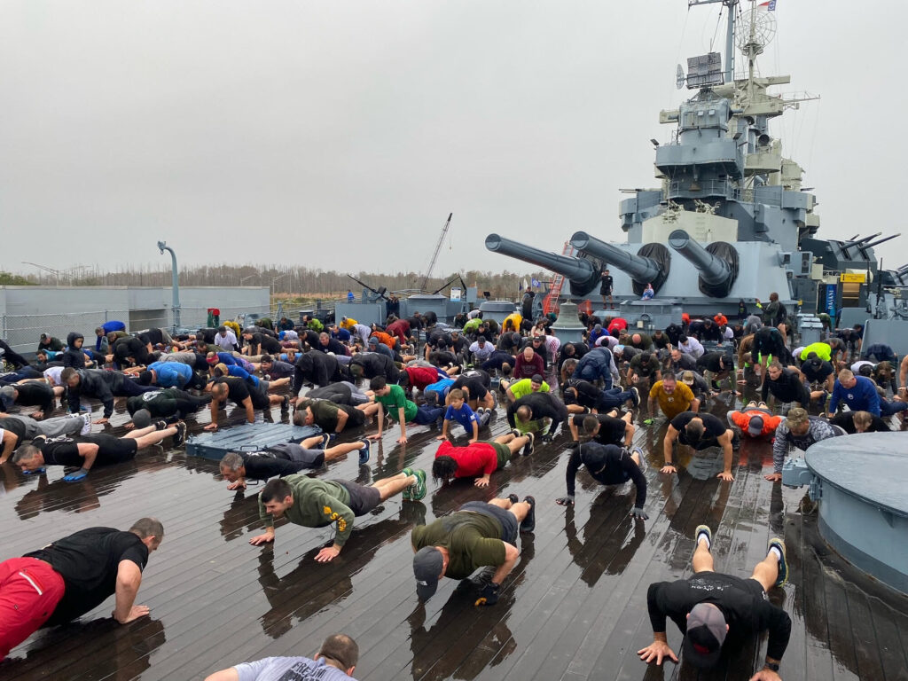

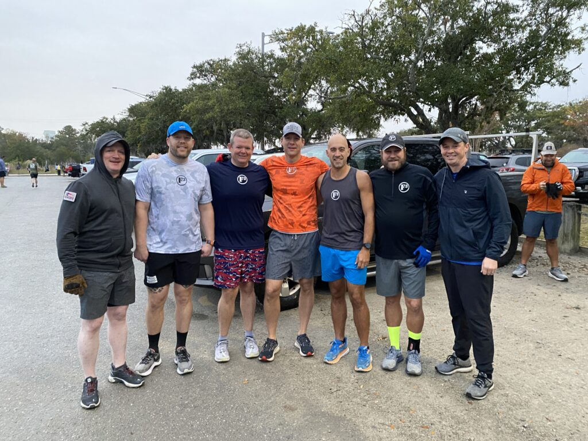

**GROWSCHOOL:**

I’ve done some q-source stuff with Carpex and the q-source rucks but it was cool getting to hear Uno, Bono, and Power Clean talk us through it and it was even cooler getting to talk to my elbow-mate, Drill Press, from F3 Uwharrie, about the socratics. We had a lot in common and it was great to be able to share with him and process a lot of that head knowledge.

After Grow School, we headed down to Prodigal’s place (which ended up being an  awesome decision because it was only about 5 minutes from the startex, whereas the hotel was about 30 minutes. We stopped at Chick-Fil-A after learning that Tea Party has strong opinions on sandwich restaurants (don’t try to go to Jersey Mike’s). Got to Prodigals, ate, showered, napped, then did a gear check with everyone just to make sure we had what we needed before departing for Mike Chappell Park.

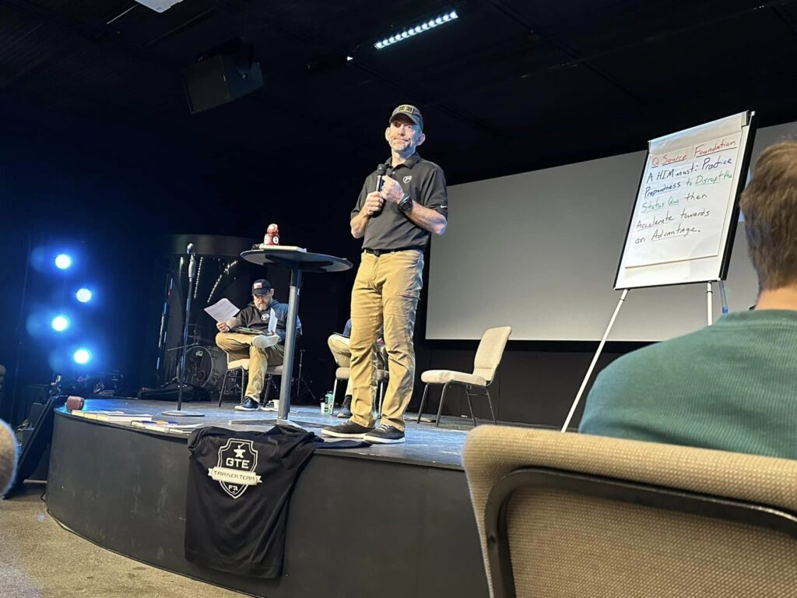

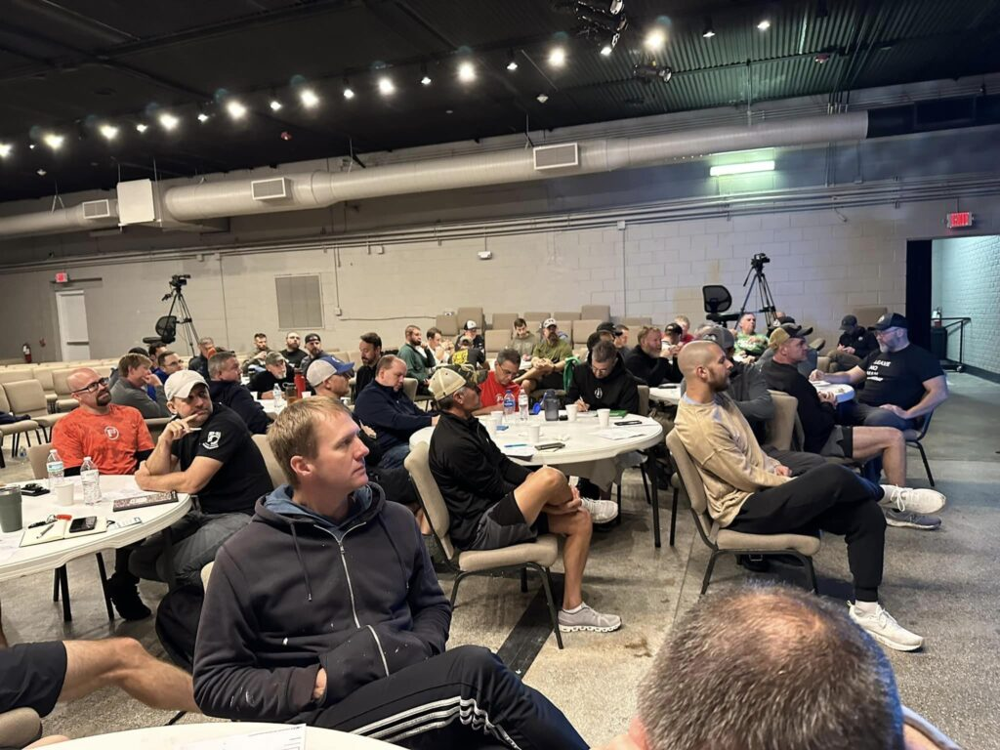

**CRUCIBLE RUCK**

**Admin/PT Test**

We arrived early to make sure we were parked and ready to go. All 77 of us lined up on one of the end lines on the field, but already made our first mistake and earned some PT to start off the night. Once we finished that, we were introduced to the Cadre and support team. Of course, right about 5PM, it started to rain and didn’t really stop for the rest of the event. Our lead Cadre for GTE-44 was Major Payne. Alongside him was Slaughter, Akron, and Uncle Rico. The Cadre took some time to talk about the nature of the event and how it would work. Major Payne then led us in a reading of the “Man in the Arena”:

It is not the critic who counts; nor the one who points out how the strong person stumbled, or where the doer of a deed could have done better.

The credit belongs to the person who is actually in the arena; whose face is marred by dust and sweat and blood who strives valiantly; who errs and comes short again and again, because there is no effort without error and shortcoming; who does actually strive to do deeds; who knows the great enthusiasms, the great devotion, spends oneself in a worthy cause; who at the best knows in the end the triumph of high achievement; and who at worst, if he or she fails, at least fails while daring greatly.

Far better it is to dare mighty things, to win glorious triumphs even though checkered by failure, than to rank with those timid spirits who neither enjoy nor suffer much because they live in the gray twilight that knows neither victory nor defeat.

We split up into 3 platoons, red, white, and blue. I was in the red platoon with Uncle Rico while the other 4 pax were in the blue platoon with Akron. I was a little disappointed we weren’t all in the same platoon but I know I got the experience I needed from the night. The Cadre for the white platoon was Slaughter. Once in formation, we completed our gear check which involved taking everything out of our rucks and putting it in a specific order/orientation. Here was what we were supposed to have:

**Mandatory Packing List:** 

- Rucksack (20L minimum suggested volume)

- 30lb weight (20lb weight if GRP weighs under 150lbs)

- 4L of fluid (combined total between hydration bladders and bottles)

- Headlamp w/red light capabilities (\*Recommend waterproof headlamp)

- 1 full extra set of batteries for your headlamp

- Reflective bands attached to Rucksack

- Carabiner suitable for climbing (check to make sure that it is CE EN and/or UIAA certified)

- Photo identification

- $20 in cash

- Work gloves

- Windbreaker

- Field notebook (\*Recommend waterproof notebook)

- Writing utensil (pen or pencil) 

After our gear check, we completed our PT test. The standard was 40 hand-release merkins in 2 minutes, followed by 40 butterfly situps in 2 minutes, followed by a 2 mile run in under 19 minutes. We started with the HRMs. I’ve been training those for a couple of months and regularly hit 50 in the 2 minute time hack. I only got 39 of them during the PT test. I had some trouble sleeping leading up to the event and just think that, and some of the initial PT took its toll. I met the standards for the butterfly situps and the run pretty easily. Missing the standard on the HRMs got in my head and stayed there all night. I was super disappointed after training pretty hard and was just frustrated that I didn’t hit it. Major Payne told me I would have the opportunity to try again later in the evening. I was just glad it didn’t stop me from continuing. Lesson learned is to be able to hit the standard, even when you aren’t feeling the best. “No one cares what you can do when you are fresh”

**Welcome Party**

Throughout the night, we were given scenarios to follow. Going along with the theme, we followed the USS North Carolina and were to act as a group of marines on board the USS North Carolina, in a variety of situations. We started July 11, 1942 in Pearl Harbor, on the USS North Carolina, escorting the USS Enterprise carrier group, along with 8 destroyers, to the South Pacific. We were to provide security by manning the Mark 12 5” 38 caliber guns and completing other tasks. For this, our platoons went to different parts of the field for some Payne Games. At our first station, we had to move the powder for the guns (wild sandbags) with Uncle Rico and had some fun with them. At our next station, with Akron, we were under attack by Japanese Zeros and did lots of rolling, running, and taking cover. At the final station, we had to load the ammunition (ruck plates) with Slaughter.

**FormEx and Payne Game 1:**

Next, we practiced getting into formation and moving safely with our platoon before picking up our sandbags and getting back into formation for our first inter-platoon competition, a ruck overhead hold. Red platoon had two members go over 5:30 on their hold for the competition win. Our platoon leader was able to assign each of the three class weights to a platoon; the three class weights were a nautical chain, a battleship cut out of a piece of metal, and a wheel contraption. Our team ended up with the chain, which was certainly the easiest to transport. We were given a few minutes to replenish water, reorganize/repack our ruck, and have a bite to eat. We also had a couple of visitors. Apparently, a group of 3 marines had left the Marine Ball and saw a bunch of red lights out in the middle of the field and thought, “why are all those cars out there doing donuts?” so, they pulled in to check it out only to encounter us. They spoke with the Cadre and the Cadre gave them a few minutes to speak to us about who they were and what they were doing; this was really cool. 

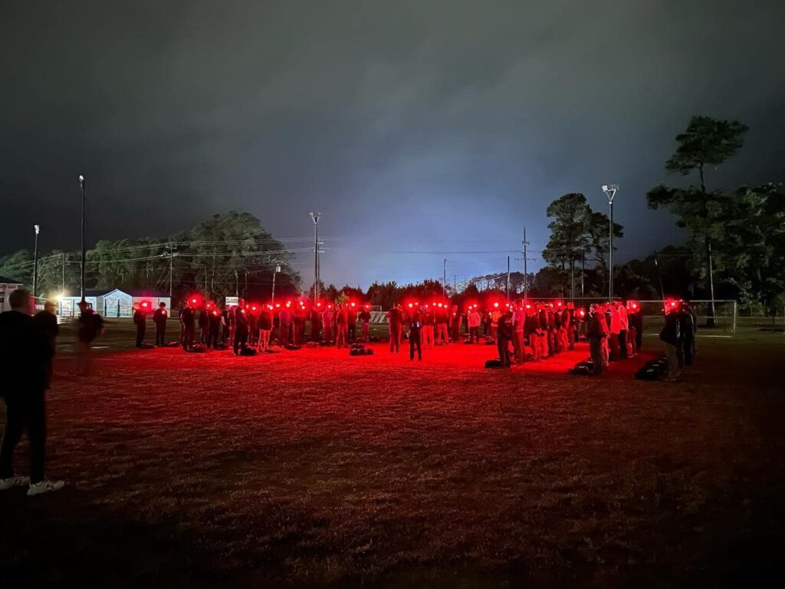

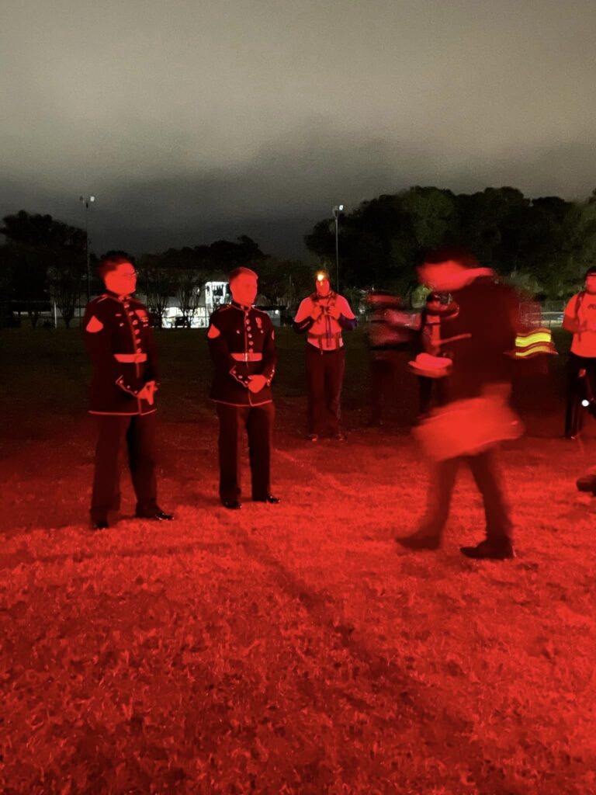

Before leaving, Major Payne gave each platoon a copy of “Man in the Arena” and said that, at some future point, we would be offered the opportunity to say the poem, from memory, in exchange for not having to carry the team weight.

**Slick and Payne Game 2:**

We departed the park and, along our route, some local firefighters were watering the street outside the fire department. This caused a little bit of chaos and resulted in our platoon breaking some safety rules and receiving some subsequent punishment. We continued on our movement and caught up with two other platoons who were leaving the beautiful Cape Fear River. I remember Uncle Rico having us stop and listen to the chaos that was going on and he let us know that would not be happening with us. As they left, we completed some reverse lunges into the water, followed by some HRMs, finishing with some lunges. 

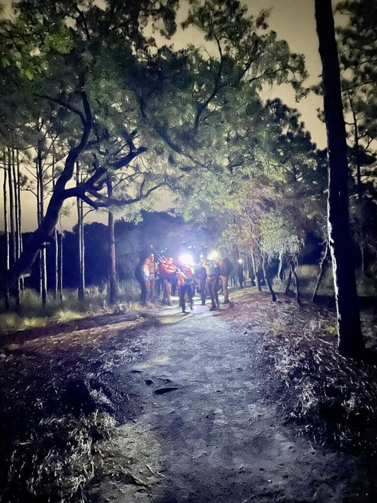

We continued our movement until we caught up with blue and white again at a parking lot. We were given a few minutes to eat/drink and I took the opportunity to put on a dry shirt and the merino layer I had packed - I was still pretty cold. We had our next platoon competition that involved landmines, blindfolds, and a trust jump and ended up with the battleship as our platoon’s weight. Afterwards, a couple of squads within our platoon were sent over toward the river where we found two 16-18 ft telephone poles waiting for us. None of the platoons were ready to go when we should have been, so we did some PT.

**Heavy:**

We were given a new scenario. In this scenario, we were moving howitzer tubes in support of the USS North Carolina. I had done some research on GrowRucks and knew that, when carrying a telephone pole, the height of the pax carrying it matters. You need to have similar height people on each log or stagger the heights from tallest at the back to shortest at the front. We began moving and, soon after leaving, moved into enemy territory and had to go silent. This was certainly a challenge, especially when it came to rotating carrying the log. We had to pay the price when we reached a short rest point where we were able to put the logs down and top off water. Only one platoon was ready to go when our time was up, so we burpeed.

We continued the heavy movement for what felt like forever (I feel like we had 0.5 miles left for a couple of hours) and continued the silence. We were moving pretty well and actually passed the blue platoon, which began the movement in front of us. I learned later that Akron wasn’t too happy with this and they stopped for a little Akron-led fun. We made a time hack and were able to talk again but we also dropped a couple of sandbags and, as such, took on additional sandbags into our rotation. We encountered some locals at a bar that were very curious as to who we were and what we were doing. The log continued to be very heavy…we finally made it to a parking lot adjacent to the beach where, again, we had to pay penance for some safety mistakes along the route. We picked our logs back up and continued onto the actual beach where we were given our next task: each platoon needed to bury their logs in the sand, pointed toward the ocean at a 35-45 degree angle, acting as the howitzer guns we had carried. All 6 logs needed to be at the same angle, coming out of the ground the same distance. Once finished with our two logs, we learned that, when you are on the beach, in the middle of the night, in cold temperatures, in the rain, you learn the value of the penguin huddle. Bono also taught us that pouty penguins aren’t as warm as happy penguins. So, we became happy penguins by singing songs; the songs ranged from Happy Birthday (to the Marine Corp), to the Star Spangled Banner, to Wheels on the Bus, and Baby Got Back. After the Star Spangled banner, it was pointed out that red platoon may have a future in the music industry. 

We passed the howitzer challenge and continued to our next platoon competition, a tunnel-of-love army crawl competition. Red platoon did very well, meaning we did not have to carry a team weight on the next movement. Next, Major Payne gave the platoons the opportunity to state the “Man in the Arena” from memory. If they were able to say it, they would not have to carry any team weight. Both blue and white had someone that was able to say it to Major Payne’s approval. That was a huge achievement considering everything we had done.

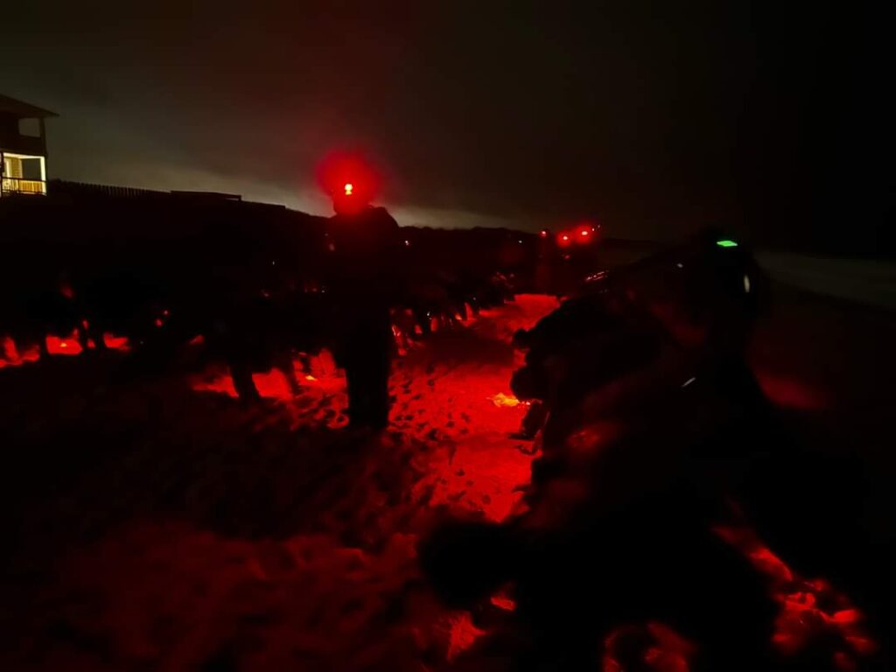

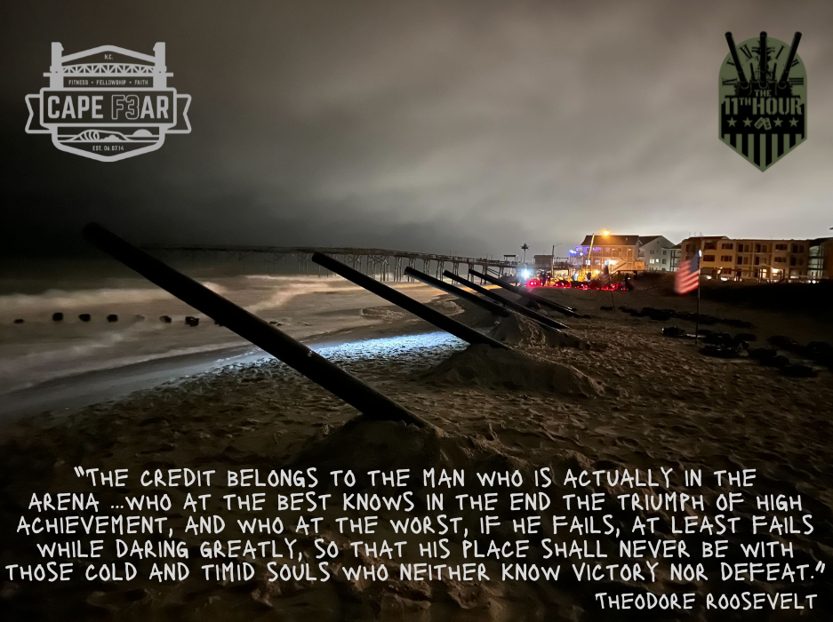

**The Quiet, Slick Movement**

We were able to leave our logs and sandbags behind as we were told we’d be heading out on a 3 mile ruck down the beach and we needed to be completely silent. As we headed out, there was definitely a sense of relief and “relaxation” being able to move without any coupons. The good thing about starting this movement is that I was able to warm up quicker; however, we were still rucking in the soft sand, on the beach, in the wind and rain so, there was only so much warming up you could do. I found myself using a tactic Bono had mentioned earlier of just counting my steps so, I just kept counting up to 100 until we finally made it to the end of the ruck. It started to get brighter and brighter so I knew the sun was coming up. I had done some research ahead of time and knew that the sunrise in Carolina Beach was at 6:41AM, so I knew we had to be close to done. We planted our flags and circled up around them as a class for our next activity, a Hero WOD.

**HeroWOD and Sunriser:**Atomic Wedgie shared some about his brother, US Army Private First Class David H. Sharrett II who served and died in battle January 16, 2008. Our workout was based on numbers associated with his military division and his life, so we did 27 ruck over burpees (his age when he died), 55 squats (his high school football number), 32 merkins (he was part of the 32nd cavalry regiment), and 101 SSHs (he was in the 101st Airborne division). After completing each exercise, we completed a 400m run. At the end, I can only assume the sun was completely up but, as was the case during the event up to this point, it was raining and cloudy and cold. During the WOD, one of the members of our platoon injured his knee and there was no way, knowing we were so close to completion, we were going to let him not finish, so we loaded him up and carried him to our sunriser. I think it would have been awesome to be on the beach to watch the sunrise but, as previously noted, the weather didn’t cooperate, so the Cadre took us over the dunes and out of the wind. Wapner shared about how, shortly after he joined F3, his wife was diagnosed with Stage 4 cancer and his Cape Fear brothers stepped up and in to help support him. It was a powerful message and really reinforced a lot of what we had learned at GrowSchool and over the course of the crucible ruck.

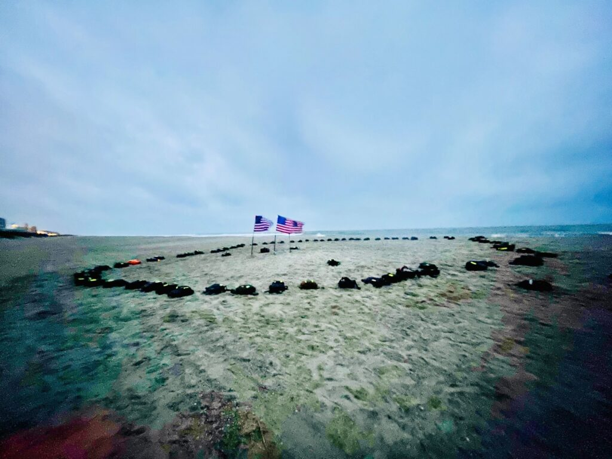

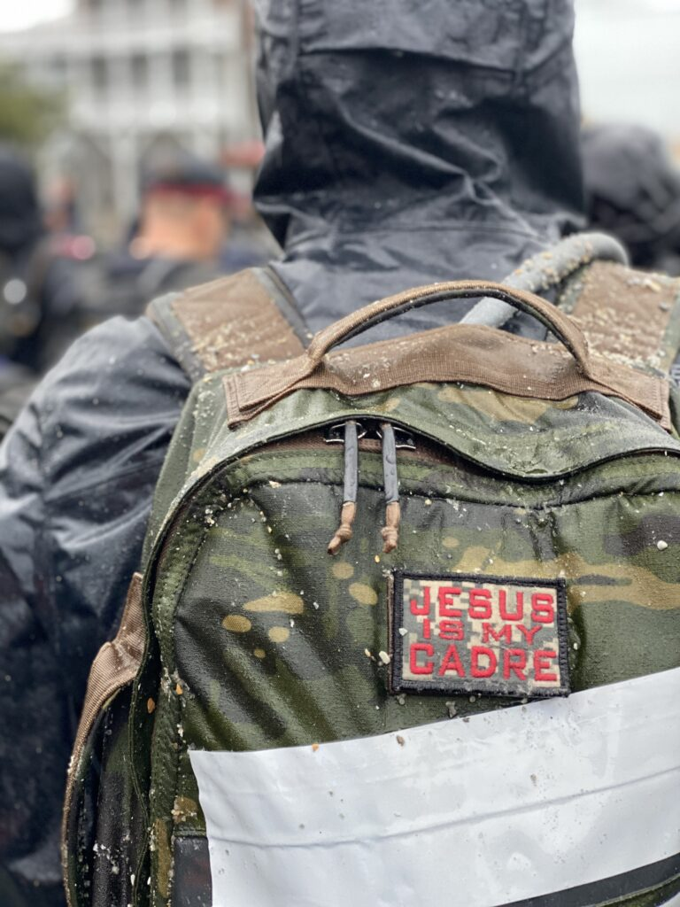

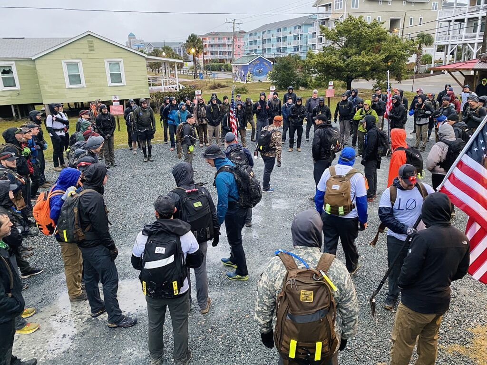

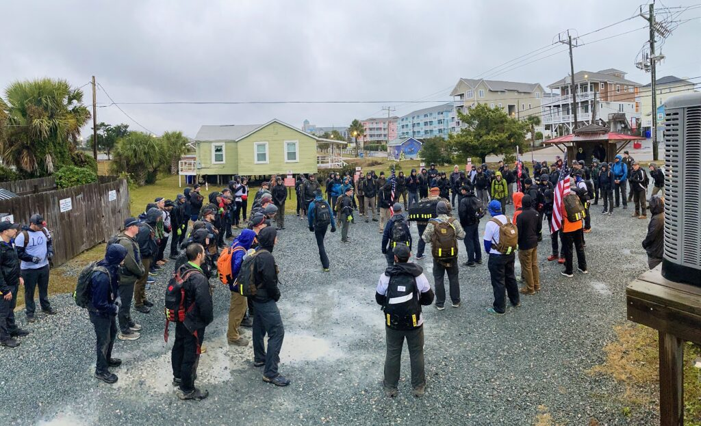

**Final Movement/EndEX:**

We had a short movement back to the flag for our EndEX. I don’t want to spoil the details about this last movement too much. Just know we put together everything we’d learned from the start to successfully complete the movement. We started with 77 and ended with 77 and, considering the weather and circumstances, that’s a pretty amazing achievement, in my opinion.

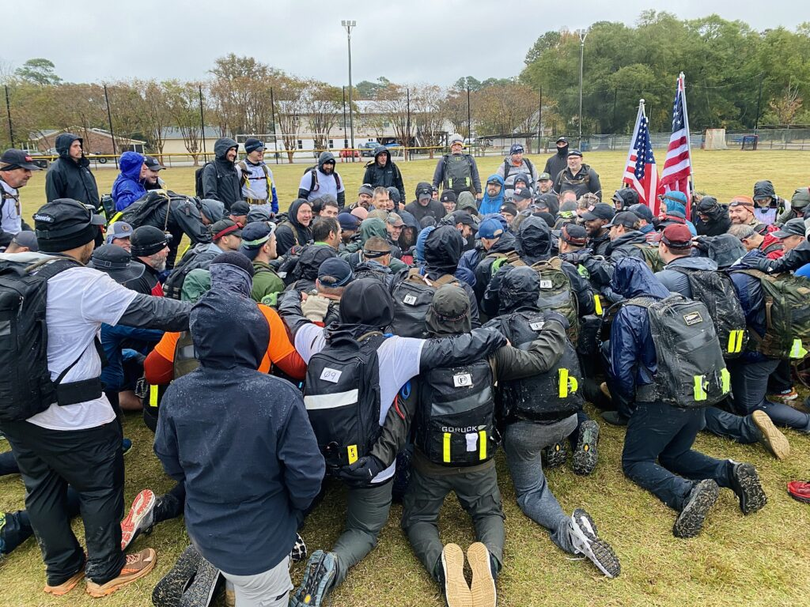

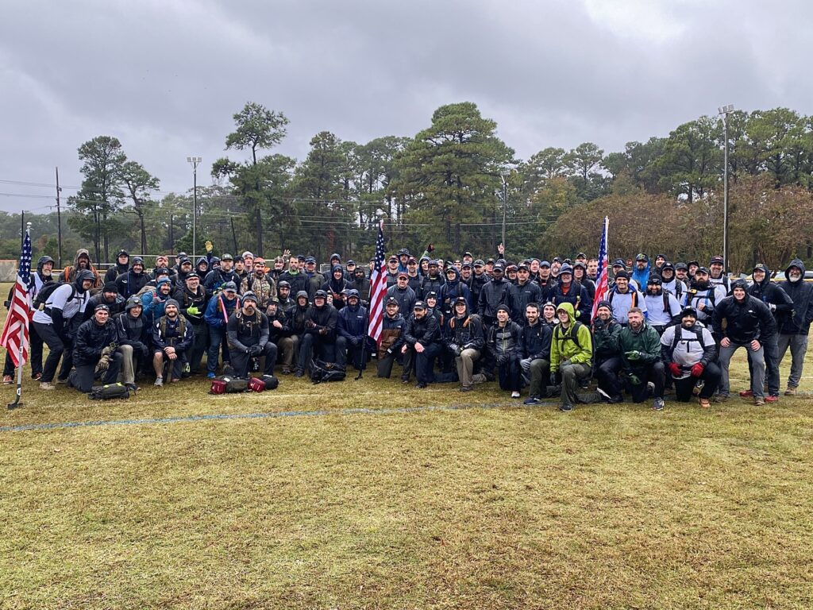

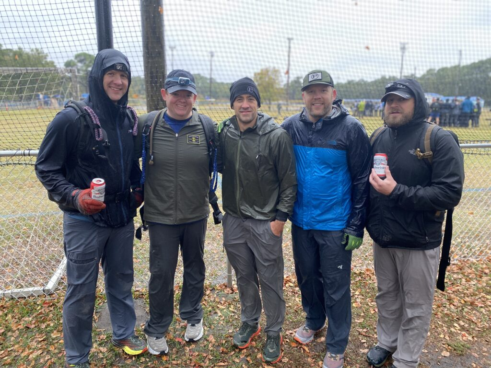

**Training:**

I started rucking pretty much as soon as I started F3 back in March in addition to the regular bootcamps. It started with just doing q-source rucks and turned into doing some EC rucks here and there. Then, in June, I completed a GoRuck Basic. It was only a few hours and around 6 miles which was the longest I had rucked up to that point. I added some more stuff after that, signing up for a couple of rounds of HDT. I’m sure it helped because I hadn’t been doing a lot of upper body stuff while rucking. It has been mostly lower-body focused. I completed Carpex’s CSAUP, The Odyssey, in October which was a good training ruck (especially considering it rained the whole time just like the GTE). I felt good after that and started working with Parker and Tea Party on doing group rucks/training as we approached the event. I wasn’t able to make the longer rucks on the weekend but did them on my own at home. I’d been going to bootcamps pretty much everyday, including Saturdays, with a mix of HT, Regular, and limited-run, so fitness wise, I felt pretty good. I regularly practiced the PT test movements and felt pretty comfortable with them. I did a final, long ruck when I was on vacation in Myrtle Beach the weekend before the event. It felt good and was, again, a confidence booster to get some time under weight, in the sand.

**Gear:**

_2 is 1 and 1 is none._

What I carried:

In/On my Ruck (the required stuff):

- GoRuck Rucker 4.0 25L

- 30lb GoRuck Ruck Plate

- [3L Source, low-profile water bladder](https://www.amazon.com/Source-Tactical-Gear-Widepac-Hydration/dp/B008S9E0RY/ref=sr_1_6?crid=27FXBSBMB4P9X&keywords=3l+source&qid=1700160870&s=sporting-goods&sprefix=3l+source%2Csporting%2C111&sr=1-6&ufe=app_do%3Aamzn1.fos.18ed3cb5-28d5-4975-8bc7-93deae8f9840) (filled with water + two Tailwind packets)

- 1L Nalgene bottle

- [Black Diamond Spot 400 headlamp](https://www.amazon.com/gp/product/B0BLF4ZTLK/ref=ppx_yo_dt_b_search_asin_title?ie=UTF8&th=1) + 3 extra AAA batteries

- 2 reflective bands attached to my ruck

- [2 Locking, climbing carabiners](https://www.amazon.com/gp/product/B0C7BVRX4G/ref=ppx_yo_dt_b_search_asin_title?ie=UTF8&th=1) - on the outside of the ruck

- My ID (I had an old, expired one that I used so I didn’t risk losing my real one)

- $20 cash

- Some basic, [Lowes work gloves](https://www.lowes.com/pd/CRAFTSMAN-Mens-Hmpe-Nitrile-Dipped-Multipurpose-Gloves-Large-x-large-1-Pairs/5013242411)

- GoRuck Simple Windbreaker - in [dry bag](https://www.amazon.com/gp/product/B001Q3KKPU/ref=ppx_yo_dt_b_search_asin_title?ie=UTF8&psc=1) #1

- [Waterproof notebook](https://www.amazon.com/gp/product/B00262E6PU/ref=ppx_yo_dt_b_search_asin_title?ie=UTF8&psc=1)

- Sharpie to write with

In/On my Ruck (not required)

- Extra t-shirt - in [dry bag](https://www.amazon.com/gp/product/B001Q3KKPU/ref=ppx_yo_dt_b_search_asin_title?ie=UTF8&psc=1) #1

- VRST Merino Blend sweater - in [dry bag](https://www.amazon.com/gp/product/B001Q3KKPU/ref=ppx_yo_dt_b_search_asin_title?ie=UTF8&psc=1) #1

- Extra socks - in [dry bag](https://www.amazon.com/gp/product/B001Q3KKPU/ref=ppx_yo_dt_b_search_asin_title?ie=UTF8&psc=1) #1 - didn’t use

- Nuun electrolyte tablets

- 2x Individual Tailwind packets - didn’t use

- 2x Honey Stinger waffles - didn’t use

- Sandwich bag of peanut M&Ms - didn’t use

- Sandwich bag with Nerd gummy clusters - didn’t use

- 3x Fruit Leather - ate 1

- JackLinks Beef Stick

- Extra [headlamp](https://www.amazon.com/gp/product/B01KYTR0HM/ref=ppx_yo_dt_b_search_asin_title?ie=UTF8&psc=1)

- Two extra [valve kits](https://www.amazon.com/gp/product/B007TJ7G98/ref=ppx_yo_dt_b_search_asin_title?ie=UTF8&psc=1) which came in handy when two other pax’s valves broke before we even left StartEx (I had two extra because I forgot I already had an extra and ordered it - with it being so small, I decided to just carry both)

- Basic foot care stuff: [Nut butter](https://www.amazon.com/gp/product/B07BR2CBT3/ref=ppx_yo_dt_b_search_asin_title?ie=UTF8&th=1), KT Tape strips, leukotape

- Homemade ruck straps (I made them out of some paracord I had sitting around and a couple of small carabiners)

What I wore:

- Under Armour compression shorts

- [Wrangler Men’s Pants](https://www.walmart.com/ip/Wrangler-Men-s-and-Big-Men-s-Outdoor-Stretch-Zip-Cargo-Pant/398341498)

- [Arcade Belt](https://www.amazon.com/gp/product/B0B3267JH1/ref=ppx_yo_dt_b_search_asin_title?ie=UTF8&th=1)

- [Long Sleeve compression shirt](https://www.amazon.com/gp/product/B09XCCBHHL/ref=ppx_yo_dt_b_search_asin_title?ie=UTF8&psc=1)

- Short sleeve F3 Sport-Tek Competitor T-shirt

- [Under Armour Tactical Hat](https://www.amazon.com/gp/product/B09WD9N5SC/ref=ppx_yo_dt_b_search_asin_title?ie=UTF8&th=1&psc=1)

- [Balega Running Socks](https://www.amazon.com/Balega-Enduro-V-Tech-Quarter-X-Large/dp/B09HKH8HYN/ref=sr_1_8?crid=2N9HZO6AN5OK8&keywords=balega%2Bsocks%2Bmen&qid=1700162467&sprefix=balega%2Bsocks%2Bmen%2Caps%2C105&sr=8-8&th=1&psc=1)

- [Hoka Arahi 6](https://www.hoka.com/en/us/mens-everyday-running-shoes/arahi-6/1123194.html)

**Notes about my gear choices:**

When I first started rucking, I jumped in quickly and purchased a GoRuck Rucker 4.0 20L a couple weeks after first starting. After completing the GoRuck, I realized that the 20L was a little too short for my torso and the hip belt didn’t fit right; fortunately, Tea Party had a 25L that was a bit too long for his torso so we swapped them. 

I mostly rucked in my tennis shoes but experimented a little with some Jedburghs and Ballistic trainers. The Jedburghs gave me hot spots after just a mile or so. The Ballistic Trainers didn’t cause much trouble but I wasn’t sure how they would work considering their lack of grip. II did a GoRuck Basic in June and blistered my feet pretty badly, so I took the next couple of months to try and figure out what I needed to do to avoid that for the GTE. The solution ended up being better-fitting shoes (I went to Fleet Feet for a fitting) and some Nut Butter. I wore the same Hokas I wear for the beatdowns and applied a decent amount of the Nut Butter and I didn’t have any issues at all after the event.

I’m glad I brought the merino sweater because it definitely got cold. I didn’t put on the windbreaker until toward the end of the Welcome Party, when we were about to leave on our first movement.

This was my first time using the Tailwind and I couldn’t really tell a difference but, over 15 hours, I’m sure it was helpful to be sipping on those calories as the night went on. Food wise, I just never felt very hungry and only ate one of the fruit leathers and the beef stick. I did have some of the Nerd clusters and peanut M&Ms on the way back to the house, though.

**Takeaways:**

Leading up to the event, especially the week of the event, I was super nervous and excited, mostly excited. Doing The Odyssey ruck was a confidence boost. I was glad I’d be doing it with Parker, Tea Party, and Triple Lindy. I wish we had been in the same platoon together but am happy that I got the experience I got. 

I was super disappointed when I didn’t pass the PT test by that one rep. I trained pretty hard and thought I would be able to complete it pretty easily. I was embarrassed and felt like just stepping out and quitting because of it. I was fortunate to have two, very encouraging pax talk to me, Beauty and Sticks. Beauty was in my squad and Sticks was a member of LC-048, a leadership course for potential future cadre, that was going on during the same time as the GTE event.. If it hadn’t been for the two of them checking in on me, I could have spiraled further down and may have quit. Beauty was encouraging and positive throughout the entire night, telling jokes and helping to keep it light. Sticks regularly came around, looking me in the eye, and just asking me how I was doing which helped me to keep pushing.

I truly contemplated quitting a few times and the fact that I made it through really helped me to reinforce that I can do hard things, sometimes harder than I thought I could. One of the ways the cadre and LC class members encouraged us was to remind us to find our “why.” Why you are here in this world, why I was doing this difficult event, and why I wanted to be a better person. “He who knows his why, can endure almost any how.” I thought about this throughout the night and I regularly came back to my M and shorties. They are why I want to be a better man; I want to be the best husband I can be and the best father I can be for them. 

On the day we finished, if you asked me if I would do another GTE, I would have said absolutely not. I was freezing cold, extremely tired, and physically/mentally drained. But, as I’ve had the opportunity to reflect and look back on my experience, I can see myself doing another event; especially if there is another guy or group of guys that want to do one. I’ve heard them say that you do your first GTE for yourself and you do your second for your brothers around you. I can see how having that knowledge that I can make it through can definitely help in future GTEs get other pax through to the end. 

I think everyone should take an opportunity to do a GTE. It’s challenging and pushes you to your limits but, as men, that’s something we need to do. It definitely made me tougher and taught me a lot about myself and my capabilities.
