My rucking journey started in 2015, shortly after I started posting at F3. In my second or third week, I fell for the classic line "if you can do this, you can do..." which in this case was a [GORUCK Tough custom event with F3 Raleigh](https://youtu.be/6lw482e4O-0). I was hooked, and have been taking on new challenges ever since. There are too many highlights to name, but some standouts include doing my first Heavy with Candlestick and Kanye, meeting Cadre Heath, Dan, and DS, and being part of the GrowRuck team and getting to give away some of the magic of F3 and rucking to other men.

Doing an HTL seemed like such an audacious goal that I had to build up to it mentally before I could even consider it a possibility. Getting that first Heavy completed started to bring it into focus. I had always thought I'd train and complete the event alongside a group of F3 brothers, as I'd seen guys do a few times. The Churham custom HTL came at a time when I wasn't quite in shape enough to tackle it, but it brought the idea to mind.

The 9/11 events have always held a special fascination. I did a 9/11 Tough in Raleigh in 2016, and Chris and Heath did a fantastic job weaving in the history lessons and timeline from the day into the event. So, when the 20th anniversary came around and I was in decent shape, I made it my goal to complete the HTL in New York City. I'd always thought that NYC 9/11 might be my first Heavy, and having already crossed that off the list, it seemed fitting to take a crack at the HTL.

For the 20th anniversary, GORUCK ran two weekends of 9/11 HTL. I chose the first one because it fit my schedule better, and while the much larger event on the actual anniversary weekend would've been great, I was glad to have been in a smaller event. I had one rucking buddy from NC who I thought may be at the event, but COVID conspired to keep him out of it. As he would've been staying with family, I made my own arrangements to travel and stay.

The hotel I stayed in set a new mark for sketchiness. There was some severe flooding the night before I arrived, and I was glad that my Queens basement apartment AirBnb didn't work out as it probably would've been under water. Still, I walked into the hotel lobby and was greeted by a desk behind bulletproof glass, and a lady in a "DEA ENFORCEMENT" jacket talking to the clerk. It turns out she was just another local resident displaced by the flood, but it made for a few moments of contemplation. The room was barely serviceable; I reasoned I wouldn't be there long anyway. I did find a fantastic local BBQ joint around the corner, and started formulating my plan for recovery between events.

I did the usual thing of overthinking what I'd brought with me, and on a short jaunt into the city I picked up an additional pair of Smartwool socks and a long-sleeve tech shirt. Both proved unnecessary but made for a good distraction. I picked up some protein shakes and other nutrition for between events.

## Heavy

I hopped in an Uber to get to the start point on Randall's Island which is off the east side of Manhattan between 100th and 125th streets. It's also home to the mental hospital that inspired Arkham Asylum, which seems fitting. This particular weekend it also hosted a huge EDM festival, so traffic was a mess, and there were all sorts of interesting people walking around. I had a hard time sorting out the "ruck weirdos" from the EDM weirdos, but eventually found a group of folks with rucks and flags.

The Cadre were also tied up in traffic, so we hung out in a baseball field and got to know each other a bit until they arrived. I knew Cleve was one of the OGs and was excited but nervous as to what he'd bring. Chris "Norwich" introduced himself as well, and we got down to business. We had five first-timers among the group for the Heavy, among 17 starters.

The welcome party consisted of Cleve's Deck of Death. Aces were worth 20, faces 15, and down. Jokers meant a run around the ball field. We did squats, flutter kicks, 8-counts, and Brickyard Manmakers (lunge/lunge, squat, thruster). New guy Dan led us with the deck shuffled but the Jokers strategically placed. We had to take a pause as one of the participants hit the deck and required medical attention. He dropped and we continued, but were 12 minutes late on our 1-hour time hack. I'm sure we paid for that at some point.

<figure>

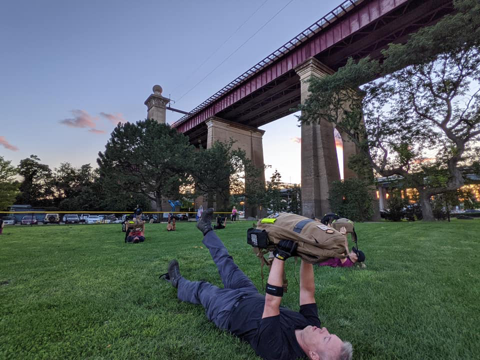

<figcaption>

Welcome party - working through the Deck of Death

</figcaption>

</figure>

Our 12-miler was to be six laps of a 2-mile course around the island, and we did a sighting lap first with the Cadre. We paired or grouped up a bit, and I went with Dan who's a mechanical engineer for a Navy contractor. We had a good opportunity to get to know each other, and were able to roughly estimate our pace vs one of the other groups as they went the opposite direction for a few laps. We finished at 3h24min, the second group to do so but quickly followed by the rest, some of who squeaked in under the 3h30min wire. We'd hoped for about 20 minutes of recovery, but it was not to be.

One of the highlights of the night was seeing the [9/11 memorial light columns](https://en.wikipedia.org/wiki/Tribute_in_Light) in lower Manhattan from across the river; they normally only light them up on the anniversary, but I believe they were testing them out during one of our laps. It helped set the tone in our minds early.

At this point Maddie, a young marine who I figured would be a strong teammate, dropped, having broken her bite valve and struggled a bit on the 12-miler. We were sorry to see her go, but had work to do. We filled 3x 120lb sandbags with wet, coarse sand from a nearby construction area, and at least 2 more 80s. It was clear we'd have our work cut out for us. There were also some ammo cans and other coupons in the mix. We were already to the point where there weren't many empty hands.

We set off along the now-familiar island greenway, but this time took the pedestrian bridge to Manhattan at 103rd street. It was exciting to be moving into new territory, but the 12-miler had taken a lot out of me. I'll admit I was in the pain cave for a bit, and was not being a great asset to the team. I needed a kick in the butt, and Cleve delivered. We strategically cut directly through the Washington housing projects and navigated around Mt Sinai and into Central Park, where we were halted and given some straight talk and hard looks about how we were not working together as a team. Cleve told us we'd be doing 110 reps of 8-count manmakers to help get our minds right.

At this point, two brothers, both first-timers, quit. Just like that we lost 10% of the team, and two young guys at that. This is when it all got real - we knew nobody was coming to help us, and we would not be dumping any weight. I had no choice at this point but to put out for the team and get in the rotation on the big bags. Of course, we had to do our 110-count first.

We moved out to the Firemen's Memorial at 100th street on the West side, and Cleve gave us a history lesson about Khaleid Sheik Mohammed, the Blind Sheik, and the years of planning leading up to 9/11. This was a high point, having made it over Lex hill and starting to work well together as a team. We could tell it was the wee hours and were looking forward to sunrise.

<figure>

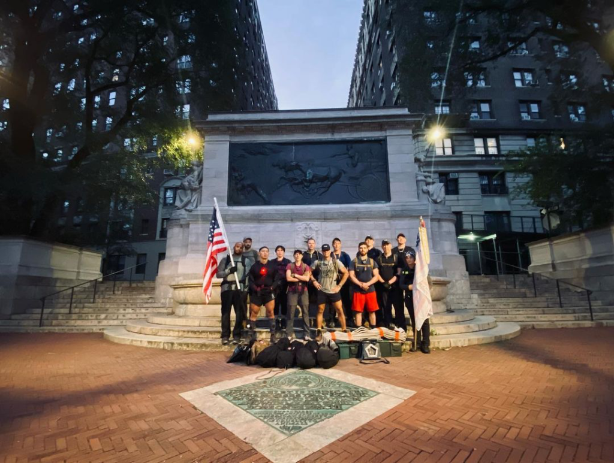

<figcaption>

Firemen's Memorial

</figcaption>

</figure>

The next stop was the Soldiers and Sailors Monument, where we dropped the coupons and commemorated the lives of the 343 FDNY lost on 9/11 with 343 weighted left/right step-ups. We took turns calling the cadence and worked through it slowly and steadily, all the while our minds on the memory of those lost attempting to save others. It was a moving moment to experience as dawn was breaking.

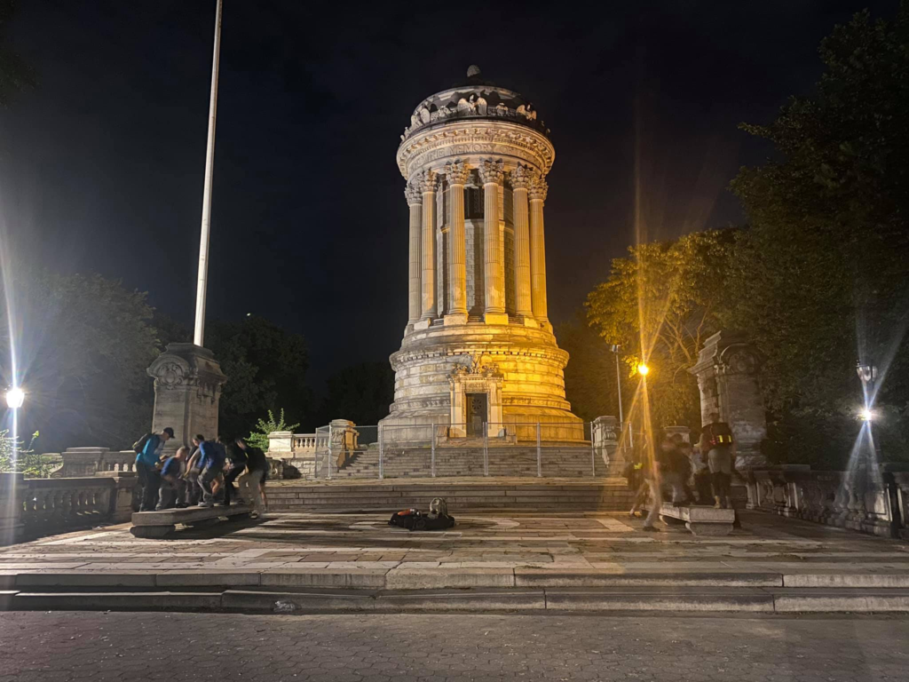

We continued down Riverside drive along the river, making a few stops along the way to refresh, refit, and also do some PT. We were taught a new exercise by Norwich, the Burton Heartbreaker. I don't recall Burton's rank, but the story goes that he was amongst the crew on a helicopter rescuing a unit, and as the LZ was hot, started just throwing guys over his shoulder onto the bird. The Burton Heartbreaker is a two-move exercise, starting in the squat position with the ruck held in your hands in front of you, and moving to an upright position with the ruck overhead. It is counted in cadence and is as terrible as it sounds.

<figure>

<figcaption>

Making our way down Riverside Drive

</figcaption>

</figure>

The mid-day sun was beating down on us at this point, and we welcomed a trip to a splash pad to get properly wet. The local kids who were enjoying the water were more than happy to help drench us with a bit of coaching from the Cadre.

<figure>

<figcaption>

A little splash pad refreshment

</figcaption>

</figure>

We heard about the John James fire boat which was pressed into service on 9/11 ([check out this Pick Up The Six episode](https://open.spotify.com/episode/3ig9Qq5LsXTdKZYMivBJyv?si=d9c7693298994849) for another side of the same story), and met up with a 9/11 survivor named Stubby who was a maintenance worker at WTC. Stubby talked about the role of the merchant marine that day helping evacuate people, and how his own Vietnam war-era training kicked in as he helped shepherd people to safety. "I'm not a hero," he said, "I was scared out of my mind. I just went back to my training."

At this point I took a stint as TL, and led the team to the Engine 7/Ladder 1 station on Duane St. The folks at the station let us inside to see wrecked pieces of their engine, helmets, and other apparatus now on permanent display at the station house. It was a powerful reminder of how the crews responded on that day, not knowing what they'd get into. A team from this station was the one doing a sewer inspection that day, who caught footage of the first plane striking the tower.

Of course, we couldn't visit a fire house without having them hose the team off while we did 8-counts. You could tell it was also the highlight of their day, and a good reason to block traffic for a few minutes.

<figure>

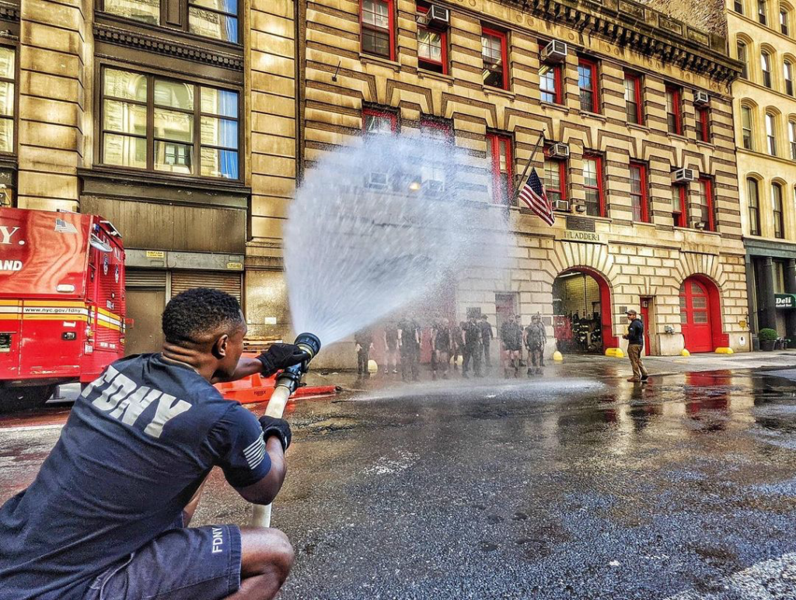

<figcaption>

Engine 7 / Ladder 1 crew showing their hospitality

</figcaption>

</figure>

We moved out once again and headed to the Horse Soldier, just south of the WTC memorial garden. We paid off a flag violation with some step-ups, and it was time for ENDEX. We had 13 finishers.

<figure>

<figcaption>

ENDEX at the Horse Soldier

</figcaption>

</figure>

Had I known for sure that we'd be ending in lower Manhattan, I would've tried to stay there instead of in Queens. As it was, I hopped in a cab, which then made a wrong turn into a tunnel that ended up taking longer than it should've to get me back to my place. I had about four hours until the start of the Tough, so set to my priorities of work, got some calories in, about 90 minutes of sleep (I tried to time it to get one complete sleep cycle, and it seemed to work out), and a shower and fresh clothes.

## Tough

Once again, traffic was terrible getting on to the island where the EDM festival was in its second day. We formed up on the same ball field and the five HTLers did our best to stretch and prepare for what we knew was ahead. The other four were Alan from NC, a certified beast and ultramarathon guy, Annie from NM who sits at a missile console for hours (and whose brother came in for the Tough), Bobby 9000, human cyborg, and Eugene, a school teacher from NY.

There were some F3 guys from Philly in the mix, and it was nice to make some introductions. We got down to business with the Deck of Death again - this time Aces were worth 15, and we had someone in the group who knew how to "beat the deck." I'll keep the spoiler, but suffice to say we did a good job on it. We did have a guy start puking during the welcome party, and later Cleve told us he would puke, then crawl a few yards, puke again, and repeat. As he also said something about having back problems, he was dropped. We had another class member who was having a really hard time keeping up on the bear-crawl Joker laps, and despite our attempts to encourage him, he dropped before the welcome party was over.

<figure>

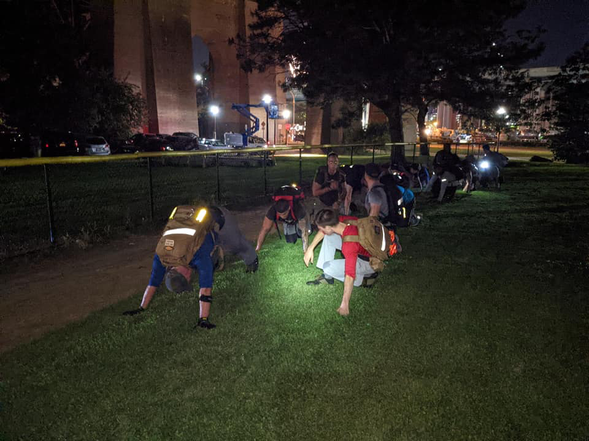

<figcaption>

Bear crawling a Joker during the Welcome Party

</figcaption>

</figure>

We moved out to the sand pile and again filled 3x120, 60, 80, and overstuffed an 80 to 100. One of those 120s felt more like 150 with the coarse, wet sand. Again we crossed over the pedestrian bridge into Manhattan and through Central Park, having taken a slightly better routing this time to avoid backtracking (and the projects.)

At the Firemen's Memorial, we sat down for the history lesson the Heavy crew had heard the previous night. Cleve told us "if anyone nods off, we will thrash." It was a struggle, and I recall the HTLers elbowing each other a few times or trying to position ourselves so it wasn't so obvious that we were checked out.

As we got up, Annie turned to me and said "Hey.. were you.. like.. seeing things? I saw like a big drive-in movie screen with all the stuff Cleve was talking about, and people down below milling around.." I've heard of hallucinations during endurance events, and haven't experienced them myself, but it was a wake-up call of just what a state we were in. Later on, I would experience what I call "pixel drag," where I would catch a glimpse of my own foot out of the corner of my eye and be surprised by it, like my brain wasn't quite keeping up with what was going on.

Once again we went down Riverside to the Soldiers and Sailors Monument and again did 343 left/right step-ups. This time it was harder to keep up with the fresh Tough crew on the cadence, but we got through it. We set off again, and instead of heading further south, we cut over on 72nd past the Dakota into Central Park. We attempted unsuccessfully to negotiate dumping some weight, then headed into Times Square where we took pictures in front of the giant lighted flag. Some of the class found coffee and attempted to find bathrooms with limited success.

<figure>

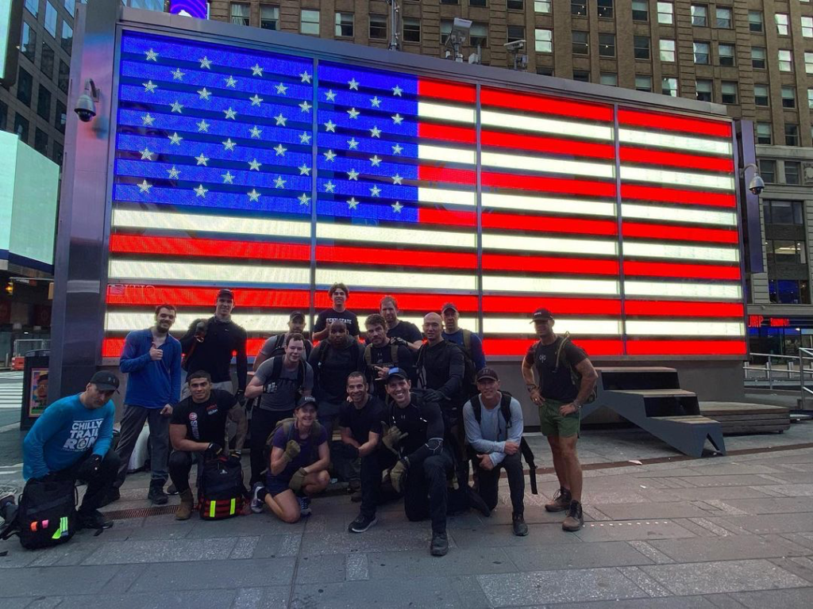

<figcaption>

'murica.

</figcaption>

</figure>

We made our way downtown on Park, and our TL at this point was having a hard time keeping things together and keeping us motivated. Annie stepped up without anyone asking, slung one of the 120s over her back and got us moving and motivated. A bunch of us had to pee, but Cleve didn't want us to stop and quite rightly questioned why we hadn't taken care of that previously. We were SO relieved to hit Union Square park with its restrooms, and as a bonus we got to empty one of the 120s. The team felt the accomplishment of having been through a tough slog and come through it together.

I was relieved, and yet I felt like I'd missed a chance to be That Somebody, either by providing some candor to the TL and trying to get him back on track, or taking charge myself. I was grateful that we had someone who had done so, and tucked this away in my mind as one of those times to recall later when being hesitant. Be An Asset, indeed.

We meandered our way through lower Manhattan, I think on Broadway through Washington Square, where we picked up Freedom Tower in the skyline and drove onward toward it, with the Sunday morning NYC crowd looking on and cheering us forward. It was fairly straight on to the Horse Soldier at that point and our second ENDEX.

<figure>

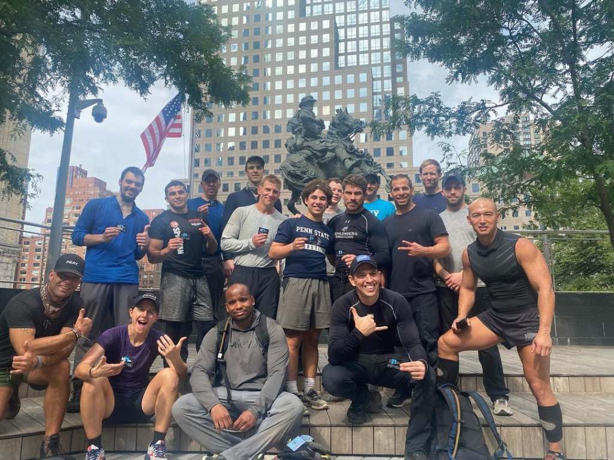

<figcaption>

Tough crew at ENDEX

</figcaption>

</figure>

By this time it was at least 10:30am, and I was left with little time to get back to my place in Queens for a refit. I did so anyhow, getting some calories, fresh clothes and a rinse, but no sleep. We had some conflicting directions as to where the Light (Basic) start point was - blame HQ - so it took a bit of extra time to get assembled.

## Light (Basic)

The Light launched in lower Manhattan at Rockefeller Park, and we did an abbreviated Deck along with some other welcome party activities. All five HTLers were back at it for the final stint. It was good to have some fresh faces in the mix and get to know some other folks, many of whom were local. One of the things that made this event so special was to hear the stories of the locals about what they experienced on September 11, 2001. I recall standing in a large open area at the tech campus I worked on, watching the buildings fall on TV, and how silent a room of a few hundred people suddenly became. The perspective of those who saw the same thing in person, or were caught trying to evacuate the city in the aftermath was illuminating to say the least.

The class made its way to the Vietnam Veterans Memorial, where we performed the requisite 343 left/right step-ups. Cleve said he would gladly sign off on Chad 1000x for the HTLers, having accumulated that many reps through the weekend.

Before the event, we were encouraged to bring a photograph and biography of someone killed in the attacks, whether it was a personal connection or, for those like me with no direct connection, someone of our choosing. I chose [FDNY firefighter Tommy Schoales](https://www.firehero.org/fallen-firefighter/thomas-gerard-schoales/), who was close to my age at the time. Tommy was the son of a firefighter, and though he originally chose NYPD as his path, he transferred to the fire service and was stationed at Engine 4 / Tower Ladder 15 in lower Manhattan.

It was thus a fantastic coincidence that Cleve had arranged for us to pass, and visit, the Engine 4 house on our way through the city. We were invited in to see the memorial room set up in the station, and I got to spend a few minutes reflecting on Tommy and the rest of the 14 from the station who were killed that day.

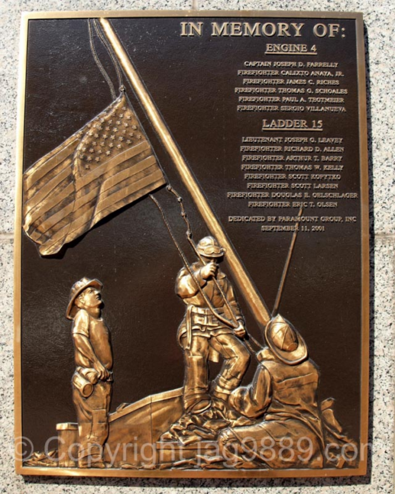

A few blocks away from the station, we made our way to the Brooklyn Bridge pedestrian crossing, and rucked across the bridge. It was a windy day, and I had the flag at that point. It took a good bit of concentration and focus to keep the flag up and proud, and it was also tough to gauge how fast or slow we should be moving as we were strung out single file. The contrast between the station house memorial and life as normal on the bridge was interesting; life keeps moving, and that's part of the beauty. Families keep playing, friends enjoy each other's company, and people enjoy life in the city all these years later.

<figure>

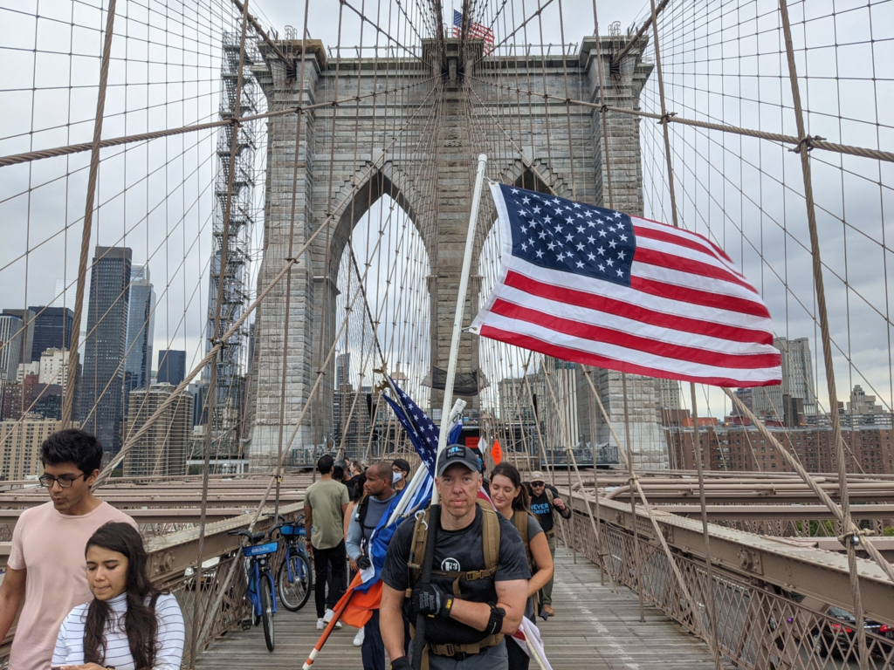

<figcaption>

Making our way

</figcaption>

</figure>

<figure>

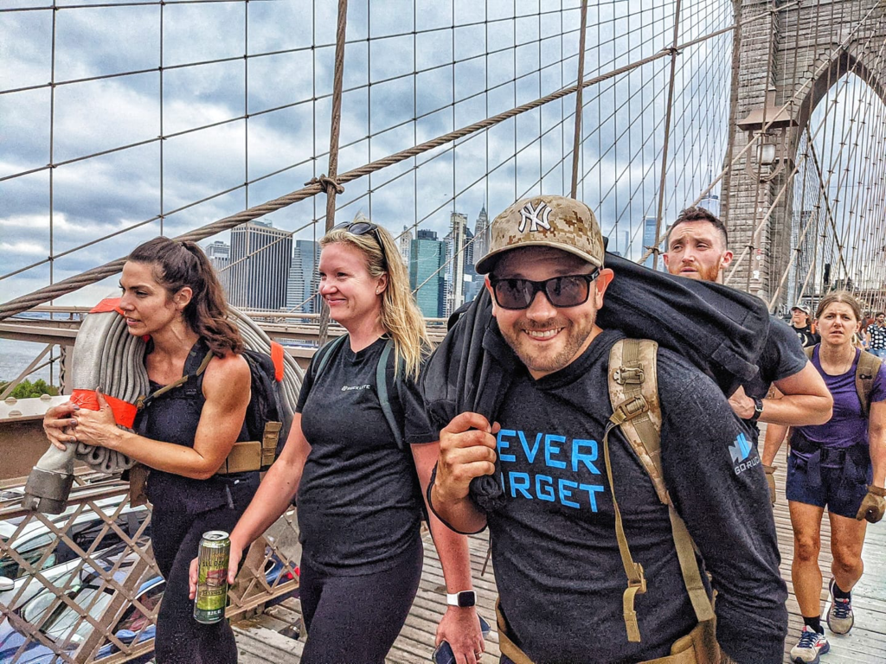

<figcaption>

Sunday Cleve is the best.

</figcaption>

</figure>

When we got to the other side of the bridge, we found a spot on a sandy beach suitable for doing hydro-burpees, and the class enjoyed the cheers of the crowd as we endured the chilly water.

<figure>

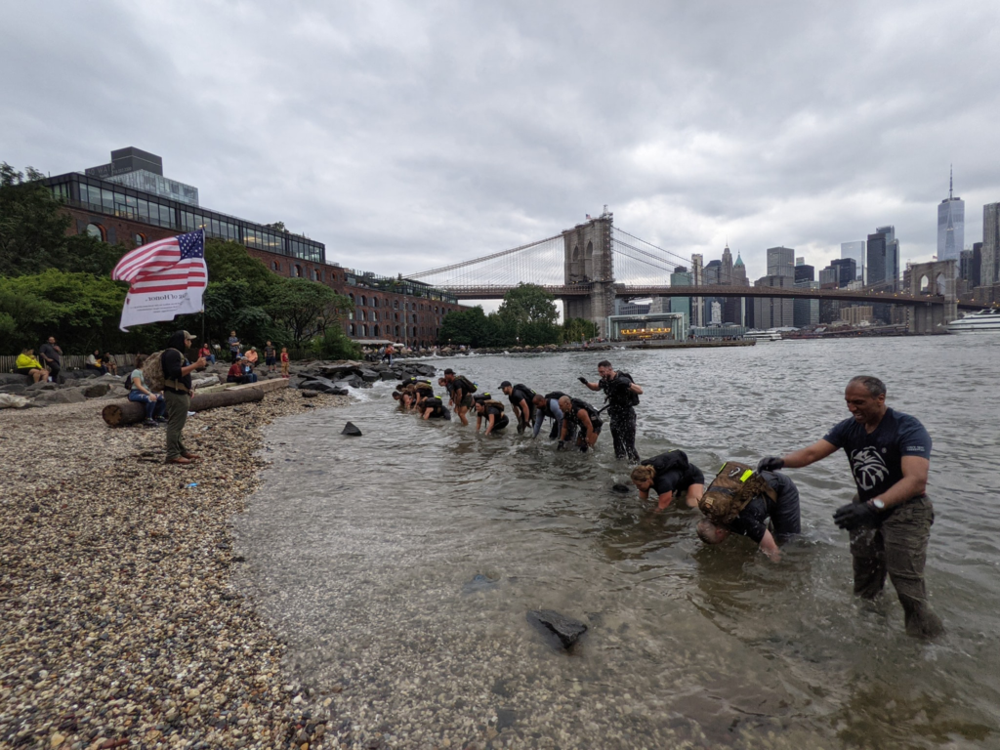

<figcaption>

Hydro-burpees!

</figcaption>

</figure>

The trek back across the bridge was uneventful, and I found myself on one of the sandbags for a good bit of it. It was a great way to wrap up the weekend, once again finding ourselves at the Horse Soldier for patches and beers.

<figure>

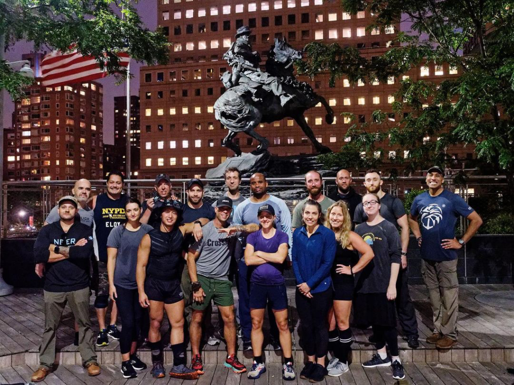

<figcaption>

The Light crew

</figcaption>

</figure>

After patching the Light class, Cleve brought the HTLers up and gave an overview of what we'd done. A good bit of the Light class was not aware, and it was a little fun to see their eyes widen as they were told that the five of us had barely slept in 48 hours. We got our HTB patches and took one last photo under the statue.

<figure>

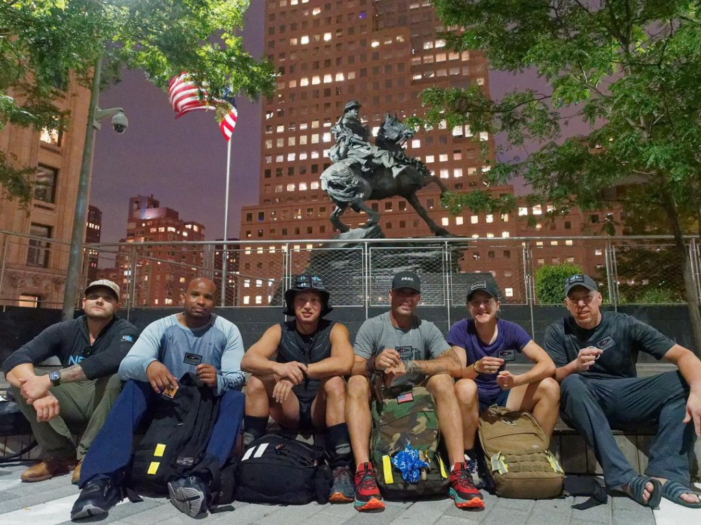

<figcaption>

HTLers

</figcaption>

</figure>

You'll notice I'm wearing sandals, which felt amazing after all of that. Once again I'd found myself leading up to an event with a pair of boots that was near the end of its useful life, but not enough time to break in a new pair. Cleve even commented during some flutter kicks about how much tread I didn't have, but it all worked out. The boots were unceremoniously retired in a trash can at the corner of Liberty and West streets, and I hopped in an Uber back to Queens. I managed to get back just in time to dump my stuff, and go around the corner to John Brown BBQ for a post-event meal. It was thoroughly legit.

Next time when planning such an event, I will NOT schedule an 0800 flight out the next morning! Though it was good to get home, another couple hours' sleep would've been welcome.

All in all, I ended up still in a bit of disbelief that I was able to pull this all off at 45 years old. The combination of doing weight training, HDT, and doubling that down with regular doses of F3 helped put me in the best possible position to succeed. Will I do another? Well.. it would have to involve a strong pull from some F3 brothers, and that's all I'll commit to for now. I'm grateful for their support and the patience and support of my family to continue to do questionable things and participate in the Worst. Hobby. Ever.

<figure>

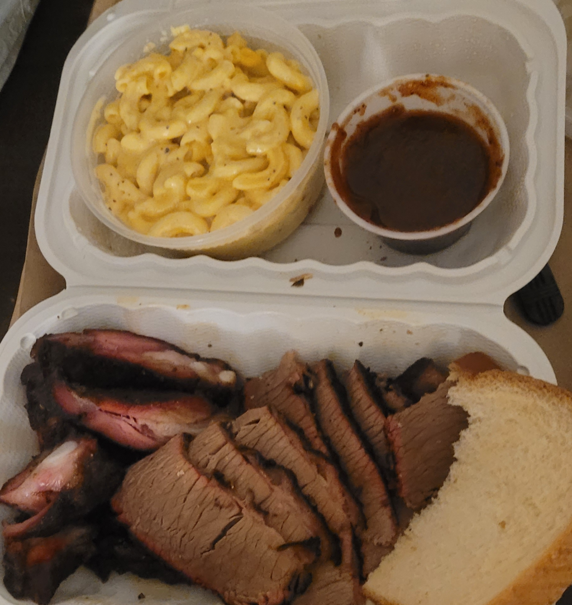

<figcaption>

We do it for the patches, and the BBQ.

</figcaption>

</figure>

Most of the rucking photos above were taken by Carlos Orduz, who provided a ton of logistical support throughout the weekend.
